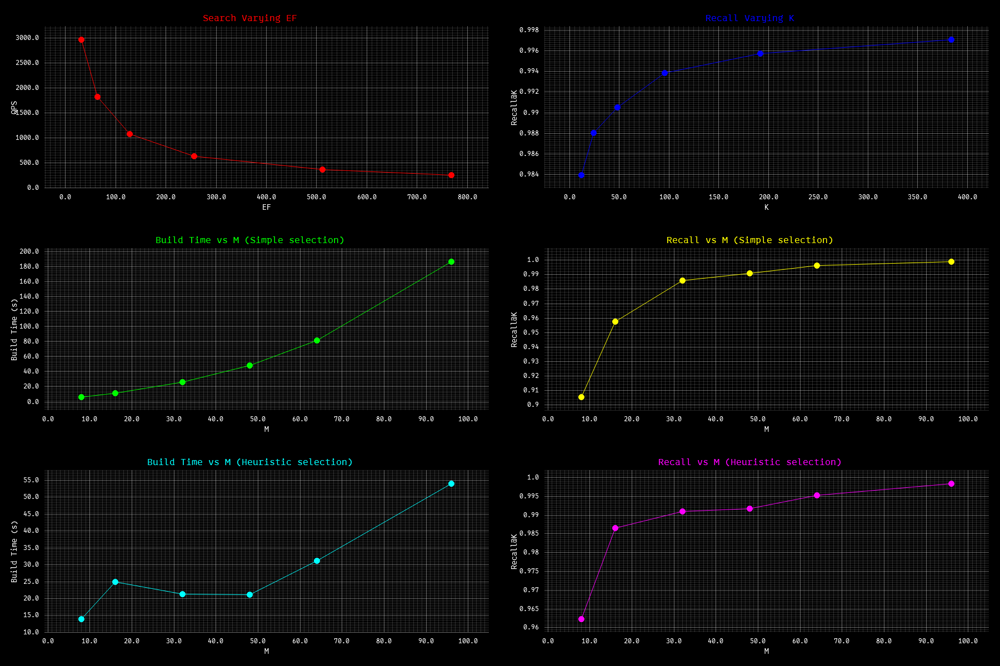

An implementation of **HNSW (Hierarchical Navigable Small World)** algorithm for approximate nearest neighbor search.
This is pretty much "paper-compliant" based on the [paper](https://arxiv.org/pdf/1603.09320),
its simplified, well documentated and easy to understand & reason, while still being *reasonably* efficient and
robust, I guess

Checkout this repo: [blaze-db](https://github.com/ronakgh97/blaze-db), which is a vector database built on top of this
HNSW implementation.

**How to bench**?

Make sure to have cargo & this [dataset](https://huggingface.co/datasets/KShivendu/dbpedia-entities-openai-1M)

```shell
cargo run --bench bencher  -- ../../datasets/dim1536_size1M 4
                                         <path to dataset> <num of files to read>
```

```shell
# Alg. 3 (simple, paper default): max_n: 16, ef_const: 96, max_l: 18, metrics: cosine
Total vectors: 153848, dimension: 1536
Building index with 153848 vectors...
Index built in 192.6493946s and cached to disk.

Search with ef: 32 took, QPS: 2962.89
Search with ef: 64 took, QPS: 1816.19
Search with ef: 128 took, QPS: 1077.24
Search with ef: 256 took, QPS: 628.19
Search with ef: 512 took, QPS: 366.36
Search with ef: 768 took, QPS: 255.27

Recall@12: 0.9840, Time: 33.698933
Recall@24: 0.9880, Time: 33.94069
Recall@48: 0.9905, Time: 35.086285
Recall@96: 0.9938, Time: 36.234673
Recall@192: 0.9957, Time: 37.509235
Recall@384: 0.9971, Time: 40.862423

# same config varying M (Alg. 3), sample_size: 32540
# Note: ef_const IS scales with M (ef_const = max(96, 2*M)) during this run
Build with M=8, time: 6.2587913s Recall@32: 0.9053
Build with M=16, time: 11.6744722s Recall@32: 0.9576
Build with M=32, time: 26.3725161s Recall@32: 0.9858
Build with M=48, time: 48.2179436s Recall@32: 0.9909
Build with M=64, time: 81.9606533s Recall@32: 0.9962
Build with M=96, time: 186.7846211s Recall@32: 0.9990

Heuristic selection (Alg. 4, opt-in via with_options)
Build with M=8, time: 13.8949517s Recall@32: 0.9622
Build with M=16, time: 24.938555s Recall@32: 0.9865
Build with M=32, time: 21.2540349s Recall@32: 0.9910
Build with M=48, time: 21.0623812s Recall@32: 0.9918
Build with M=64, time: 31.1729254s Recall@32: 0.9953
Build with M=96, time: 54.0370665s Recall@32: 0.9984
```

**some observations**
on [commit](https://github.com/ronakgh97/hnsw-rs/commit/57aa9fd42877c267e22645d7821c1f671ed76896)

- `ef_const = max(96, 2*M)` ensures candidate pool scales with Mmax0 (2*M at layer 0) for both algorithm, but in this
  run, we keep it fixed at 96 to isolate the effect of M
- Alg. 3 (simple_selection): build time grows with M; recall improves monotonically
- Alg. 4 (heuristic_selection): build time peaks at M=8-16, then plateaus; recall peaks at M=32
- At high M, simple selection gets more connections from fixed ef pool → higher recall, but heuristic selection
  starves → lower recall, build time drops due to fewer distance computations, selection overhead dominates, then
  finally it caps due to selection is ef_const-limited, not M-limited
- Use `HNSW::with_options(..., use_heuristic_selection=true)` for Alg. 4



Ref:

- https://en.wikipedia.org/wiki/Curse_of_dimensionality
- https://arxiv.org/pdf/1603.09320
- https://arxiv.org/abs/2512.06636
- https://arxiv.org/pdf/2406.03482
- https://arxiv.org/html/2412.01940v1
- https://www.pinecone.io/learn/series/faiss/hnsw/
- https://www.techrxiv.org/users/922842/articles/1311476-a-comparative-study-of-hnsw-implementations-for-scalable-approximate-nearest-neighbor-search

> Note: Some of the ref are of my TODO list, I have not read them yet, but I think they are relevant, so I put them here
> for future reference.